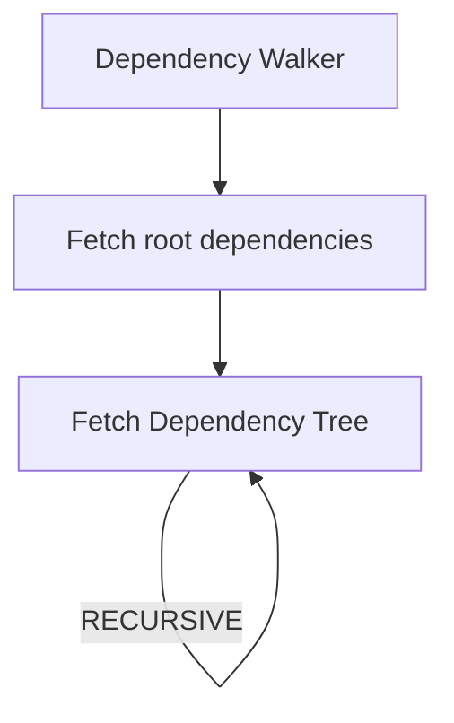

# From API

## Introduction

This is an API made to analyze a package on a remote registry (the npm registry by default).

```js
import * as scanner from "@nodesecure/scanner";

const payload = await scanner.from("fastify");
console.log(payload);
```

It is also possible to provide options as a second argument. Here are two useful options for the command:

```ts
export interface Options {
  /**
   * Maximum tree depth
   * @default 4
   */
  readonly maxDepth?: number;
  /**
   * Vulnerability strategy name (npm, snyk, node)
   * @default NONE
   */
  readonly vulnerabilityStrategy: Vuln.Strategy.Kind;
}
```

In this guide we will see in depth how the from command has been implemented and how it works.

## Steps 1: Fetching the manifest

The first step is to fetch what we call a `Manifest` on npm for a given Spec (eg `mypackage@x.x.x`). For this we use the npm library [pacote](https://github.com/npm/pacote#readme) that do all the work for us.


It is important here to dig and learn some vocabulary related to npm:
- [Manifests](https://github.com/npm/pacote#manifests)
- [Packuments](https://github.com/npm/pacote#manifests) (We will see this later).
- Spec (This is the term used to refer to the package name with optional version or SemVer range.)

To make it simple the first step is to check the existence of the package on the remote registry and to get a structure similar to the package.json.

## Steps 2: Dependency Walker

The goal of this step is to identify and walk throughout the package dependencies (that's why we call this the dependency walker). To do this we retrieve the dependencies from the root of the Manifest in step 1 and we start a recursive mechanism.



> Note: at the beginning of this step we also create a temporary directory with `os.tmpdir()`

### 2.1

The first step of fetching root dependencies is not much complicated for the `From` API (However, this phase is much more complex for the CWD command).

At this point we create an iterator that will contain both normal packages and packages with resolutions to git. Then i use [a package i created](https://github.com/fraxken/combine-async-iterators) to Asynchronously combine AsyncIterators.

```js
const configRef = { exclude, maxDepth, parent };
iterators = [
  ...iter.filter(customResolvers.entries(), ([, valueStr]) => isGitDependency(valueStr))
    .map(([depName, valueStr]) => searchDeepDependencies(depName, valueStr, configRef)),
  ...iter.map(dependencies.entries(), ([name, ver]) => searchDeepDependencies(`${name}@${ver}`, null, configRef))
];

for await (const dep of combineAsyncIterators({}, ...iterators)) {
  yield dep;
}
```

### 2.2

Everything is done using Async Generators which make everything more simple by flattening dependency. This step use the same Manifest API from pacote. If a given package still have dependencies, then the recursive function will continue to execute until there is no more (or it will stop if the maximum depth has been reach).

Here is a simplified version of the Generator function:

```js
export async function* searchDeepDependencies(packageName, gitURL, options) {
  const { exclude, currDepth = 0, parent, maxDepth } = options;

  const { name, version } = await pacote.manifest(gitURL ?? packageName, {
    ...NPM_TOKEN,
    registry: getLocalRegistryURL(),
    cache: `${os.homedir()}/.npm`
  });
  const { dependencies, customResolvers } = mergeDependencies(pkg);

  const current = new Dependency(name, version, parent);
  if (currDepth !== maxDepth) {
    const config = {
      exclude, currDepth: currDepth + 1, parent: current, maxDepth
    };

    const depsNames = await Promise.all(iter.map(dependencies.entries(), getCleanDependencyName));
    for (const [fullName, cleanName, isLatest] of depsNames) {
      yield* searchDeepDependencies(fullName, null, config);
    }
  }

  yield current;
}
```

