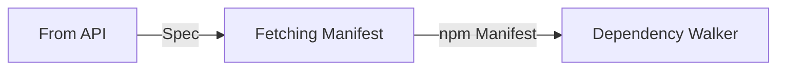
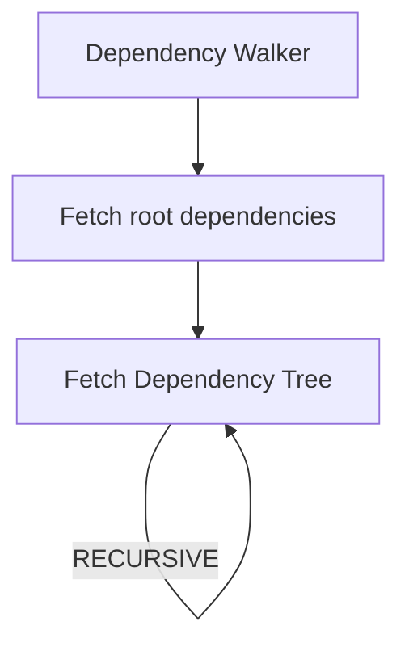

# From API

## Introduction

This is an API made to analyze a package on a remote registry (by default on the npm registry).

```js
import * as scanner from "@nodesecure/scanner";

const payload = await scanner.from("fastify");
console.log(payload);
```

It is also possible to provide options as a second argument. Here are two useful options for the command:

```ts
export interface Options {
  /**
   * Maximum tree depth
   * @default Infinity
   */
  readonly maxDepth?: number;
  /**
   * Vulnerability strategy name (npm, snyk, node)
   * @default NONE
   */
  readonly vulnerabilityStrategy: Vuln.Strategy.Kind;

  readonly registry?: string | URL;
}
```

In this guide we will see in depth how the from command has been implemented and how it works.

## Steps 0: Registry

First, we load the correct registry URL. By default, is the local registry.  The command `npm config get registry` is run on the system.
```js
const registry = options.registry ? new URL(options.registry).toString() : getLocalRegistryURL();
```

## Steps 1: Fetching the manifest

The first step is to fetch what we call a `Manifest` on npm for a given Spec (eg `mypackage@x.x.x`). For this we use the npm library [pacote](https://github.com/npm/pacote#readme) that do all the work for us.



It is important here to dig and learn some vocabulary related to npm:
- [Manifests](https://github.com/npm/pacote#manifests)
- [Packuments](https://github.com/npm/pacote#manifests) (We will see this later).
- Spec (This is the term used to refer to the package name with optional version or SemVer range.)

To simplify it, the first step is to check the package's existence on the remote registry and to get a structure similar to the `package.json`.

## Steps 2: Dependency Walker

This step aims to identify and walk through the package dependencies (that's why we call this the dependency walker). To do this, we retrieve the dependencies from the root of the Manifest in step 1 and start a recursive mechanism.



> Note: at the beginning of this step we also create a temporary directory with `os.tmpdir()`

### 2.1 fetching root dependencies

The first step is about fetching root dependencies that we previously retrieved from the manifest in **step 1**.

At this point we create an iterator that will contain both normal packages and packages with a git resolution. Then i use [a package i created](https://github.com/fraxken/combine-async-iterators) to Asynchronously combine AsyncIterators.

> 👀 From API doesn't rely on [NPM arborist](https://www.npmjs.com/package/@npmcli/arborist) (it doesn't need a **package-lock.json** file or **node_modules** directory).

```js
const configRef = { exclude, maxDepth, parent };
iterators = [
  ...iter.filter(customResolvers.entries(), ([, valueStr]) => isGitDependency(valueStr))
    .map(([depName, valueStr]) => searchDeepDependencies(depName, valueStr, configRef)),
  ...iter.map(dependencies.entries(), ([name, ver]) => searchDeepDependencies(`${name}@${ver}`, null, configRef))
];

for await (const dep of combineAsyncIterators({}, ...iterators)) {
  yield dep;
}
```

### 2.2 fetching dependency tree recursively

Everything is done using Async Generators, which make everything more simple by flattening dependency. This step uses the same Manifest API from `pacote`. If a given package still has dependencies, the recursive function will continue to execute until there are no more (or it will stop if the maximum depth has been reached).

Here is a simplified version of the Generator function:

```js
export async function* searchDeepDependencies(packageName, gitURL, options) {
  const { exclude, currDepth = 1, parent, maxDepth } = options;

  const { name, version } = await pacote.manifest(gitURL ?? packageName, {
    ...NPM_TOKEN,
    registry: getLocalRegistryURL(),
    cache: `${os.homedir()}/.npm`
  });
  const { dependencies, customResolvers } = mergeDependencies(pkg);

  const current = new Dependency(name, version, parent);
  if (currDepth < maxDepth) {
    const config = {
      exclude, currDepth: currDepth + 1, parent: current, maxDepth
    };

    const depsNames = await Promise.all(iter.map(dependencies.entries(), getCleanDependencyName));
    for (const [fullName, cleanName, isLatest] of depsNames) {
      yield* searchDeepDependencies(fullName, null, config);
    }
  }

  yield current;
}
```

Each time a dependency is retrieved the code will run two separate analyses in parallel:
- Tarball scanning (using pacote.extract)
- Fetching additional metadata on the registry

## Steps 3: Apply vulnera strategy

The third step is to recover the list of vulnerabilities using the active [vulnera](https://github.com/NodeSecure/vulnera) strategy (or nothing if no strategy is chosen).

```js
const { hydratePayloadDependencies, strategy } = await vuln.setStrategy(vulnerabilityStrategy);
await hydratePayloadDependencies(dependencies, {
  useStandardFormat: true,
  path: location
});
```

For more information on how to create a strategy and how they operate, please [read the following documentation](https://github.com/NodeSecure/vulnera/blob/main/docs/adding_new_strategy.md).

## Steps 4: Get warnings and illuminated contacts

In this step, we look for packages or authors potentially identified as problematic (by the person requesting the analysis or us).

```js
const { warnings, illuminateds } = await getDependenciesWarnings(dependencies);
payload.warnings = warnings;
payload.highlighted = {
  contacts: illuminateds
};
```

By default we show warnings for the following two packages:
- @scarf/scarf
- iohook

Since the incident with [Faker](https://snyk.io/blog/npm-faker-package-open-source-libraries/) we also identify Marak's packages as dangerous.

